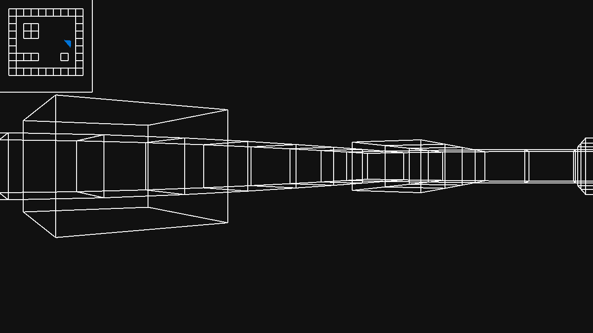

# Raycasting en ruby

Avant d'exécuter le programme, il faut que vous installiez la gem ruby2d. Une fois fait, vous pouvez exécuter le programme avec la commande ``ruby main.rb``

Pour controller la camera, il suffit d'utiliser les flèches droite et gauche pour tourner et ZQSD pour vous déplacer.

----
TEDDAC
